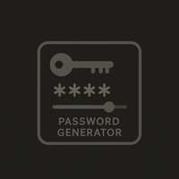

  

# 🔐 Secure Password Generator / Gerador de Senhas Seguro

  
  
  
  
  
  
  
  
  

---

## 📄 Descrição / Description

| 🇧🇷 **Descrição (PT-BR)** | 🇺🇸 **Description (EN)** |
| --- | --- |
| Gerador de senhas forte e seguro em Python, com opções totalmente personalizáveis. É possível definir tamanho, tipos de caracteres, evitar caracteres ambíguos, gerar via CLI ou via menu interativo estilizado com `rich`, copiar para a área de transferência e salvar em arquivo. | Strong and secure password generator written in Python, with fully customizable options. Supports custom length, character types, ambiguous character filtering, CLI usage, a styled interactive menu, clipboard copying, and export to file. |

---

## ✨ Funcionalidades / Features

| 🇧🇷 **Funcionalidades (PT-BR)** | 🇺🇸 **Features (EN)** |
| --- | --- |
| • Tamanho configurável • Incluir/excluir letras, números e símbolos • Evitar caracteres ambíguos (`I`, `l`, `0`, `O`) • Garante diversidade mínima dos caracteres • CLI com flags • Modo interativo “Hackerman Mode” com `rich` • Copiar para área de transferência • Exportar senha em `.txt` • Medidor simples de força da senha | • Customizable length • Include/exclude letters, digits, symbols • Avoid ambiguous characters (`I`, `l`, `0`, `O`) • Ensures minimum character class diversity • CLI with flags • “Hackerman Mode” interactive menu using `rich` • Clipboard copy support • Export password to `.txt` • Simple strength meter |

---

## 🧩 Requisitos / Requirements

| 🇧🇷 **Requisitos (PT-BR)** | 🇺🇸 **Requirements (EN)** |
| --- | --- |
| • Python 3.10+ • Dependências definidas em `requirements.txt` | • Python 3.10+ • Dependencies defined in `requirements.txt` |

### 📥 Instalação

    pip install -r requirements.txt

---

## 👤 Autor | Author  

Criado por João Albero · 2025  
Created by João Albero · 2025